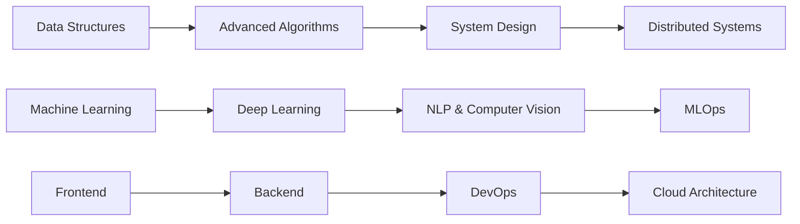

<div align="center">
  
</div>

<p align="center">
  
  
  
</p>

---

## 🚀 About Me

```javascript
const sandeep = {
    pronouns: "He" | "Him",
    location: "Delhi, India 🇮🇳",
    currentFocus: "AI, ML and Deep Learning",
    education: "3rd Phase - Computer Science",
    learningGoal: "Mastering Algorithms & Data Structures",
    askMeAbout: ["Web Dev", "AI/ML", "DSA", "Deep Learning"],
    funFact: "I debug with console.log() and I'm not ashamed! 😄",
    lifePhilosophy: "Code, Learn, Repeat ♾️"
};
```

<details>
<summary>📖 More About My Journey</summary>
<br>

I'm a passionate **AI/ML enthusiast** and **Full Stack Developer** currently navigating through the exciting world of computer science. My journey involves exploring the depths of artificial intelligence, building scalable web applications, and solving complex algorithmic challenges.

🎯 **Current Mission:**
- Strengthening my foundation in Data Structures & Algorithms
- Building production-ready full-stack applications
- Exploring cutting-edge AI/ML techniques
- Contributing to open-source projects
- Sharing knowledge through technical writing

💡 **What Drives Me:**
- Curiosity about how things work under the hood
- The satisfaction of solving complex problems
- Building solutions that make a real-world impact
- Continuous learning and self-improvement
- Collaborating with talented developers

</details>

---

## 💼 Technical Arsenal

### 🧠 AI/ML & Data Science
<p align="left">
  
  
  
  
  
  
  
  
</p>

### 🎨 Frontend Development
<p align="left">
  
  
  
  
  
  
  
</p>

### ⚙️ Backend Development
<p align="left">
  
  
  
  
  
  
</p>

### 🗄️ Databases
<p align="left">
  
  
  
  
</p>

### ☁️ Cloud & DevOps
<p align="left">
  
  
  
  
  
  
  
</p>

### 🛠️ Tools & Technologies
<p align="left">
  
  
  
  
  
</p>

---

## 📊 GitHub Analytics

<p align="center">
  
  
</p>

<p align="center">
  
</p>

<p align="center">
  
</p>

### 🏆 GitHub Trophies
<p align="center">
  
</p>

---

## 💡 Coding Journey & Achievements

### 🎯 Current Focus Areas
- 📚 **Mastering Algorithms**: Currently deep-diving into advanced data structures and algorithmic paradigms
- 🤖 **AI/ML Projects**: Building practical machine learning models and exploring deep learning architectures
- 🌐 **Full Stack Development**: Creating end-to-end web applications with modern tech stacks
- ☁️ **Cloud Technologies**: Learning AWS and GCP for scalable application deployment

### 📈 Competitive Programming Platforms

<table align="center">
  <tr>
    <td align="center" width="200">
      <a href="https://www.leetcode.com/simplysandeepp" target="_blank">
        
      </a>
      <br><strong>Active Problem Solver</strong>
    </td>
    <td align="center" width="200">
      <a href="https://codeforces.com/profile/simplysandeepp" target="_blank">
        
      </a>
      <br><strong>Competitive Coder</strong>
    </td>
    <td align="center" width="200">
      <a href="https://www.hackerrank.com/simplysandeepp" target="_blank">
        
      </a>
      <br><strong>Problem Solver</strong>
    </td>
  </tr>
  <tr>
    <td align="center" width="200">
      <a href="https://www.codechef.com/users/simplysandeepp" target="_blank">
        
      </a>
      <br><strong>Active Coder</strong>
    </td>
    <td align="center" width="200">
      <a href="https://auth.geeksforgeeks.org/user/simplysandeepp" target="_blank">
        
      </a>
      <br><strong>Practice Enthusiast</strong>
    </td>
    <td align="center" width="200">
      <a href="https://kaggle.com/simplysandeepp" target="_blank">
        
      </a>
      <br><strong>ML Explorer</strong>
    </td>
  </tr>
</table>

### 🏅 Achievements & Milestones
- ✅ Actively learning and implementing advanced algorithms
- ✅ Building projects in AI/ML and Full Stack Development
- ✅ Regular participation in competitive programming contests
- ✅ Contributing to open-source community
- ✅ Maintaining consistent GitHub activity

---

## 🎯 Learning Path & Roadmap



### 📚 Currently Exploring
- 🧮 **Advanced Algorithms**: Dynamic Programming, Graph Theory, Advanced Trees
- 🤖 **Deep Learning**: Neural Networks, CNNs, RNNs, Transformers
- 🏗️ **System Design**: Scalable architectures, Microservices, Design Patterns
- ☁️ **Cloud Native**: AWS Services, Docker, Kubernetes fundamentals
- 🔐 **Web Security**: Best practices, Authentication, Authorization

---

## 🚀 Projects & Work

### 💻 Project Categories

<details>
<summary><b>🤖 AI/ML Projects</b></summary>
<br>

Working on various machine learning and AI projects including:
- Image Classification Models
- Natural Language Processing Applications
- Data Analysis & Visualization
- Predictive Modeling
- Deep Learning Experiments

</details>

<details>
<summary><b>🌐 Full Stack Projects</b></summary>
<br>

Building full-stack applications using:
- **Frontend**: React, Angular, HTML/CSS/JavaScript
- **Backend**: Node.js, Express, Django
- **Database**: MongoDB, MySQL, PostgreSQL
- **Features**: RESTful APIs, Authentication, Real-time updates

</details>

<details>
<summary><b>🔧 Practice & Learning Projects</b></summary>
<br>

Continuous learning through:
- Algorithm implementations
- Data structure visualizations
- Mini web applications
- Code challenges solutions
- Technology experiments

</details>

---

## 📝 Latest Blog Posts & Content

<!-- BLOG-POST-LIST:START -->
- 🔥 Understanding Algorithms: A Practical Approach
- 🚀 Getting Started with Full Stack Development
- 🤖 Introduction to Machine Learning
- ☁️ Cloud Computing Basics
- 💡 Best Coding Practices for Beginners
<!-- BLOG-POST-LIST:END -->

➡️ [More posts on Medium...](https://medium.com/@simplysandeepp)
➡️ [Technical articles on Dev.to...](https://dev.to/simplysandeepp)

---

## 🌟 GitHub Contributions

<p align="center">
  
</p>

### 🎯 Contribution Goals
- 🔧 Actively contributing to personal projects
- 📝 Maintaining regular GitHub activity
- 🐛 Learning through building and experimentation
- 📖 Documenting learning journey
- ⭐ Exploring and starring useful repositories

---

## 📫 Connect With Me

<p align="center">
  <a href="mailto:sandeepprajapati1202@gmail.com">
    
  </a>
  <a href="https://www.linkedin.com/in/sandeep-prajapati-ba04451b3/">
    
  </a>
  <a href="https://twitter.com/simplysandeepp">
    
  </a>
  <a href="https://instagram.com/simplysandeepp">
    
  </a>
  <a href="https://medium.com/@simplysandeepp">
    
  </a>
  <a href="https://dev.to/simplysandeepp">
    
  </a>
</p>

<p align="center">
  <a href="https://discord.gg/simplysandeepp">
    
  </a>
  <a href="https://stackoverflow.com/users/simplysandeepp">
    
  </a>
  <a href="https://www.leetcode.com/simplysandeepp">
    
  </a>
  <a href="https://www.hackerrank.com/simplysandeepp">
    
  </a>
  <a href="https://kaggle.com/simplysandeepp">
    
  </a>
</p>

---

## 💼 Skills & Expertise

<details>
<summary><b>🎓 Technical Skills</b></summary>
<br>

```yaml
Programming Languages:
  Proficient: Python, JavaScript, Java
  Learning: C++, TypeScript
  
Web Development:
  Frontend: React, Angular, HTML/CSS, JavaScript
  Backend: Node.js, Express, Django
  Database: MongoDB, MySQL, PostgreSQL
  
AI/ML:
  Frameworks: TensorFlow, PyTorch, Scikit-learn
  Libraries: Pandas, NumPy, Matplotlib, Seaborn, OpenCV
  Focus: Machine Learning, Deep Learning, Data Analysis
  
DevOps & Tools:
  Cloud: AWS, GCP (Learning)
  Tools: Docker, Git, GitHub, VS Code, Jupyter
  OS: Linux, Bash scripting
```

</details>

<details>
<summary><b>🎯 Areas of Interest</b></summary>
<br>

- 🤖 Artificial Intelligence & Machine Learning
- 🌐 Full Stack Web Development
- 📊 Data Science & Analytics
- ☁️ Cloud Computing & DevOps
- 🧮 Algorithms & Problem Solving
- 🔐 Cybersecurity Fundamentals

</details>

---

## 🎮 Beyond Coding

<p align="center">
  
  
  
  
</p>

---

## 🎯 2025 Goals & Aspirations

- [ ] Master Data Structures & Algorithms
- [ ] Build 10+ Full Stack Projects
- [ ] Contribute to Open Source Projects
- [ ] Write Regular Technical Blog Posts
- [ ] Achieve Cloud Certifications (AWS/GCP)
- [ ] Learn Advanced System Design
- [ ] Complete Multiple ML/AI Projects
- [ ] Maintain Consistent GitHub Activity
- [ ] Participate in Hackathons
- [ ] Network with Fellow Developers

---

## 💭 Random Dev Quote

<p align="center">
  
</p>

---

## 🐍 Contribution Snake

<picture>
  <source media="(prefers-color-scheme: dark)" srcset="https://raw.githubusercontent.com/simplysandeepp/simplysandeepp/output/github-contribution-grid-snake-dark.svg">
  <source media="(prefers-color-scheme: light)" srcset="https://raw.githubusercontent.com/simplysandeepp/simplysandeepp/output/github-contribution-grid-snake.svg">
  
</picture>

---

<p align="center">
  
</p>

<div align="center">
  
### Show some ❤️ by starring repositories you find interesting!


**"First, solve the problem. Then, write the code."** – John Johnson

</div>

---

<p align="center">
  <b>💻 Made with ❤️ and lots of ☕ by Sandeep Prajapati</b>
  <br>
  <i>Currently in 3rd Phase | AIML & FSD Enthusiast | Algorithm Learner</i>
</p>

<p align="center">Last Updated: October 2025</p>
